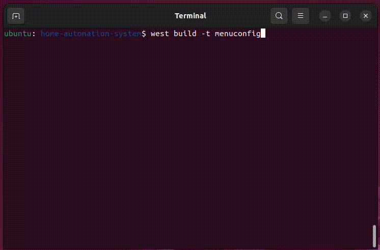
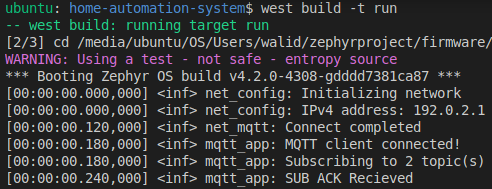

### Overview
# Home Automation System

A lightweight home automation system built with **Zephyr RTOS** and **ESP32** microcontroller, providing MQTT-based communication for remote control of electrical appliances.

## Overview

This project implements a smart home automation solution that allows users to control electrical appliances both remotely via MQTT messaging and manually through GPIO interrupts. The system is designed to be efficient, reliable, and compatible with modern IoT ecosystems.

## Features

- **MQTT Client**: Full support for MQTT v3.1.1 protocol
  - Send MQTT PUBLISH messages
  - Receive MQTT SUBSCRIBE messages
  - Lightweight publish/subscribe messaging optimized for IoT devices

## Getting Started

### Prerequisites

- Zephyr SDK installed
- MQTT broker (local or cloud-based)

### Installation

#### 1. Clone the repository:
```bash
git clone https://github.com/walidbadar/home-automation-system.git
cd home-automation-system
```

#### 2. Build the firmware
```bash
west build -p auto -b esp32_devkitc/esp32/procpu .
```

#### 3. Configure your WiFi and MQTT broker settings
```bash
west build -t menuconfig
```


#### 4. Flash the firmware
```bash
west flash
```
### Build and run with native_sim board

#### 1. Setup tap interface
```bash
sudo apt install -y socat libpcap-dev
git clone https://github.com/zephyrproject-rtos/net-tools
cd net-tools
make

./net-setup start
```

#### 2. Build and run
```bash
cd home-automation-system
west build -p auto -b native_sim .
west build -t run
```

